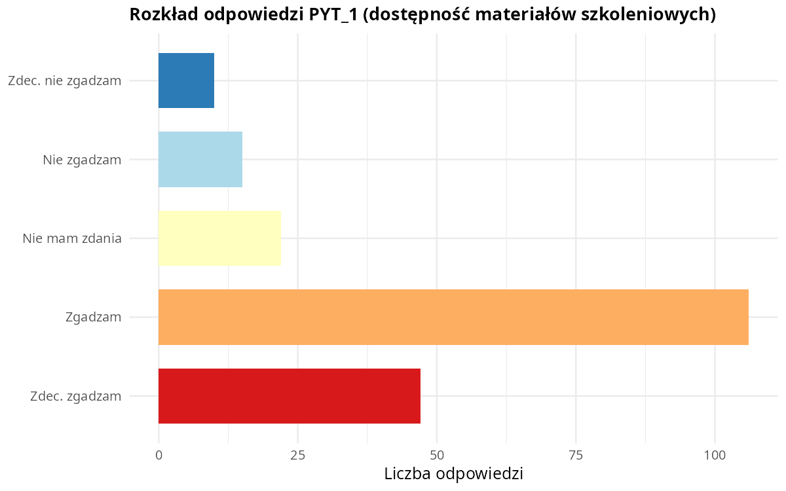
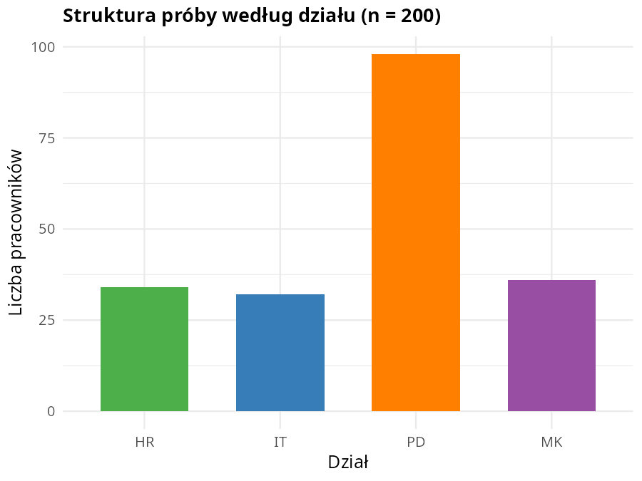
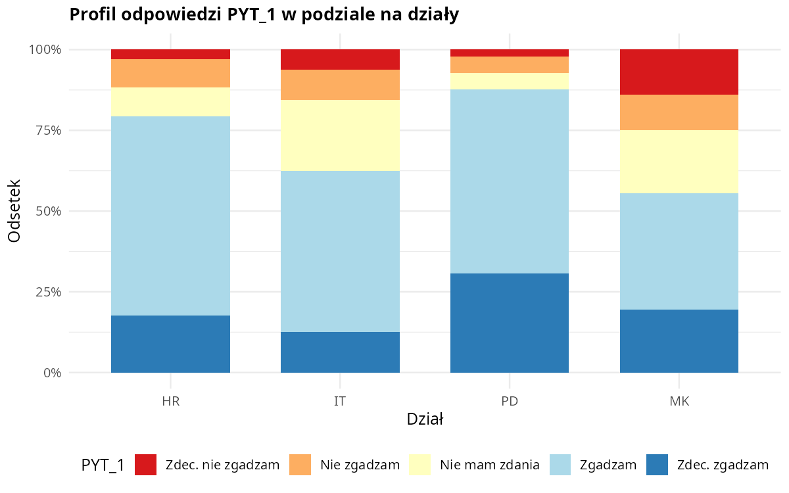
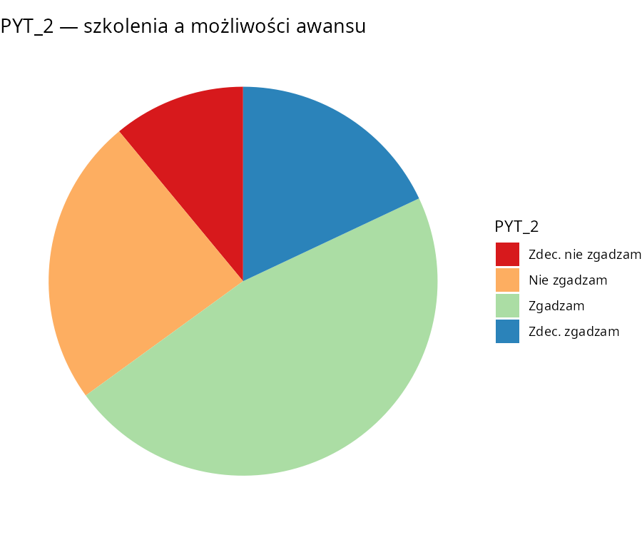

# Analiza Danych Ankietowych (ADA)

Repozytorium zawiera sprawozdania statystyczne z analizy ankiety pracowniczej dotyczącej programów szkoleniowych. Materiały przygotowano w ramach zajęć z analizy danych.

## Struktura repozytorium

| Plik | Opis |
|------|------|
| `sprawo1.qmd` | Sprawozdanie 1 — analiza opisowa, tablice krzyżowe, przedziały ufności, testy |
| `sprawozdanie2.qmd` | Sprawozdanie 2 — testy χ², Fishera, współczynniki asocjacji, analiza korespondencji |
| `sprawozdanie3.qmd` | Sprawozdanie 3 — testy symetrii, paradoks Simpsona, modele log-liniowe |
| `notebooks/sprawozdanie1.ipynb` | Jupyter — wersja interaktywna sprawozdania 1 |
| `notebooks/sprawozdanie2.ipynb` | Jupyter — wersja interaktywna sprawozdania 2 |
| `notebooks/sprawozdanie3.ipynb` | Jupyter — wersja interaktywna sprawozdania 3 |
| `ankieta.csv` | Dane ankietowe (n = 200, separator `;`, UTF-8) |
| `scripts/` | Skrypty pomocnicze (generowanie danych, wykresów, konwersja notebooków) |

## Podgląd wyników

Poniższe wykresy pochodzą z analizy opisowej danych ankietowych (zmienne `PYT_1`, `PYT_2`, podział na działy).

### Rozkład odpowiedzi PYT_1

Pytanie o dostępność materiałów szkoleniowych (skala Likerta):



### Struktura próby według działu



### Profil odpowiedzi PYT_1 w podziale na działy



### Rozkład odpowiedzi PYT_2

Pytanie o dopasowanie szkoleń do możliwości awansu:



## Wymagania

- [Quarto](https://quarto.org/) — renderowanie plików `.qmd` do PDF
- [Jupyter](https://jupyter.org/) z jądrem [IRkernel](https://github.com/IRkernel/IRkernel) — uruchamianie notebooków
- R (≥ 4.x) z pakietami: `tidyverse`, `knitr`, `kableExtra`, `scales`, `gridExtra`, `binom` i innymi wskazanymi w dokumentach
- LaTeX z LuaLaTeX (dla PDF z Quarto)

## Renderowanie sprawozdań (Quarto)

```bash
quarto render sprawo1.qmd
quarto render sprawozdanie2.qmd
quarto render sprawozdanie3.qmd
```

## Uruchamianie notebooków Jupyter

```bash
# Wygeneruj dane, jeśli brak pliku ankieta.csv
Rscript scripts/generate_ankieta.R

# Uruchom Jupyter
jupyter notebook notebooks/
```

Notebooki generuje skrypt `scripts/qmd_to_ipynb.py` (konwersja chunków R i Markdown z plików `.qmd`).

## Regeneracja wykresów w README

```bash
Rscript scripts/generate_readme_figures.R
```

Wykresy zapisywane są w katalogu `docs/images/`.

## Regeneracja notebooków z Quarto

Po edycji plików `.qmd`:

```bash
python3 scripts/qmd_to_ipynb.py
```

Alternatywnie można użyć `quarto convert`, ale zalecana jest konwersja powyższym skryptem — zachowuje on wszystkie komórki kodu R.

## Uwagi

- W kodzie R zachowano oryginalne nazwy zmiennych i poziomy faktorów (`Tak`/`Nie`, `K`/`M`).
- Sprawozdania 2 i 3 korzystają ze zmiennych zdefiniowanych w sprawozdaniu 1 (np. `CZY_ZADOW`, `WIEK_KAT`).
- Ziarno losowe `set.seed(2025)` stosowane jest w testach symulacyjnych.
